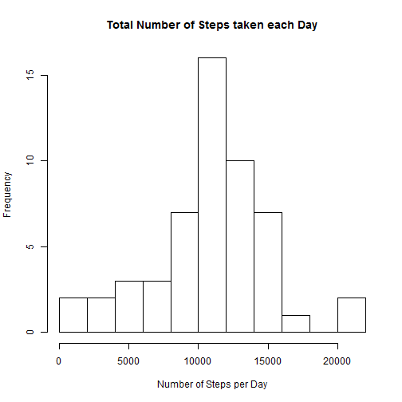
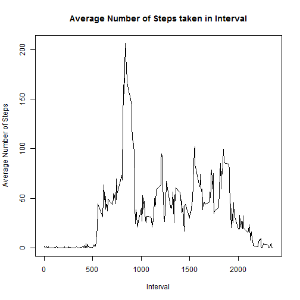
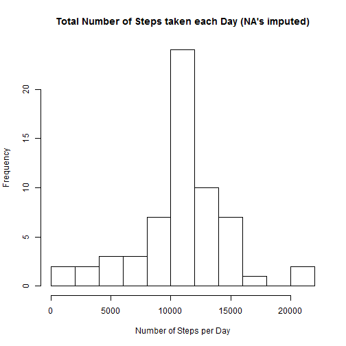
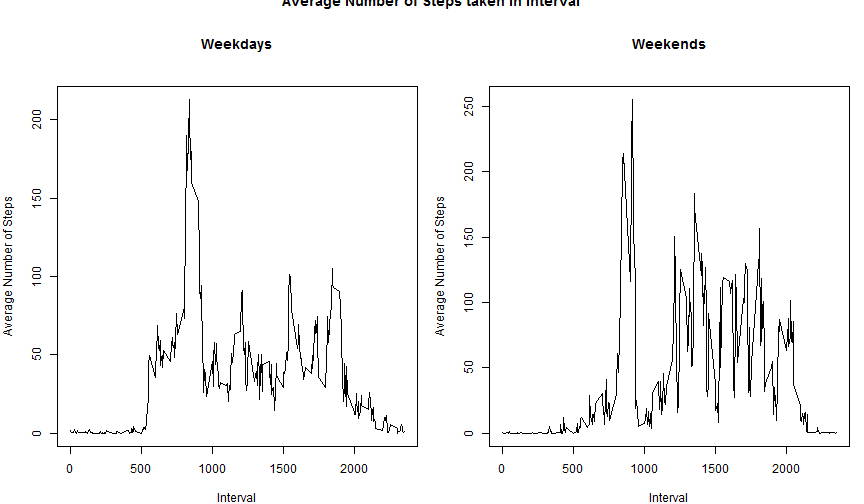

Reproducible Research - Assignment 1
====================================

HR

#Introduction

This assignment makes use of data from a personal activity monitoring device. This device collects data at 5 minute intervals through out the day. The data consists of two months of data from an anonymous individual collected during the months of October and November, 2012 and include the number of steps taken in 5 minute intervals each day.

The data for this assignment can be downloaded from the course web site:

[Activity monitoring data](https://d396qusza40orc.cloudfront.net/repdata%2Fdata%2Factivity.zip)

The variables included in this dataset are:

- steps: Number of steps taking in a 5-minute interval (missing values are coded as NA)
- date: The date on which the measurement was taken in YYYY-MM-DD format
- interval: Identifier for the 5-minute interval in which measurement was taken

The dataset is stored in a comma-separated-value (CSV) file and there are a total of 17,568 observations in this dataset.

#Loading and preprocessing the data

The data are loaded from the working directory into the object 'activity':

```r
activity <- read.csv("activity.csv")
```

#Mean total number of steps taken per day

*For this part of the assignment, the missing values in the dataset are ignored.*

##1. Total number of steps taken per day

The total number of steps taken per day is equal to the total sum of steps, divided by the total number of days, i.e. the number of unique entries in the dataset:


```r
sum(activity$steps, na.rm = TRUE)/length(unique(activity$date))
```

```
## [1] 9354.23
```

The total number of steps taken per day is 9354.

##2. Histogram of the total number of steps taken each day

In order to plot the histogram of the total number of steps taken each day, the dataset is first grouped by 'date' using the library 'dplyr', and the total number of steps are calculated for each day and stored in 'StepsPerDay', which is then plotted as a histogram:


```r
library(dplyr)
```

```
## 
## Attaching package: 'dplyr'
```

```
## Die folgenden Objekte sind maskiert von 'package:stats':
## 
##     filter, lag
```

```
## Die folgenden Objekte sind maskiert von 'package:base':
## 
##     intersect, setdiff, setequal, union
```

```r
by_date <- group_by(activity, date)
StepsPerDay <- summarise(by_date, sum(steps))
hist(StepsPerDay$`sum(steps)`,
     breaks = 10,
     main = "Total Number of Steps taken each Day",
     xlab = "Number of Steps per Day",
     ylab = "Frequency")
```



##3. Mean and median of the total number of steps taken per day

In order to determine the mean and median of the total number of steps taken per day, mean and median of 'StepsPerDay' from part (2) are calculated:


```r
mean(StepsPerDay$`sum(steps)`, na.rm = TRUE)
```

```
## [1] 10766.19
```

```r
median(StepsPerDay$`sum(steps)`, na.rm = TRUE)
```

```
## [1] 10765
```

#Average daily activity pattern

In order to determine the average daily activity pattern, the dataset is now grouped by 'interval'. The average of 'steps' is calculated for each interval and stored in 'AvgStepsPerInterval', which is then plotted:


```r
by_interval <- group_by(activity, interval)
AvgStepsPerInterval <- summarise(by_interval, mean(steps, na.rm = TRUE))
```

##1. Time series plot of the average number of steps taken

```r
plot(AvgStepsPerInterval,
    type = "l",
    main = "Average Number of Steps taken in Interval",
    xlab = "Interval",
    ylab = "Average Number of Steps")
```



##2. 5-minute interval with the maximum number of steps

Using the which-function, the index i_MaxAvg of the interval containing the highest average of steps is determined and the 5-minute interval with the maximum number of steps is selected from 'AvgStepsPerInterval' as the i_MaxAvg's element:


```r
i_MaxAvg <- which(AvgStepsPerInterval[,2] == max(AvgStepsPerInterval[,2]))
AvgStepsPerInterval[i_MaxAvg, 1]
```

```
## Source: local data frame [1 x 1]
## 
##   interval
##      (int)
## 1      835
```

#Imputing missing values

In this part of the assignment missing values are taken into account.

##1. Total number of missing values in the dataset

The total number of missing values in the dataset is:


```r
sum(is.na(activity$steps))
```

```
## [1] 2304
```

##2. Strategy for filling in all of the missing values in the dataset

First, it is checked, if NA's only occur on a daily basis or also in certain intervals during the day: The total number of NA's (NoOfNAPerDay) is calculated for each day, and the function unique tells that it is either 288 or zero:


```r
NoOfNAPerDay <- summarise(by_date, sum(is.na(steps)))
unique(NoOfNAPerDay[, 2])
```

```
## Source: local data frame [2 x 1]
## 
##   sum(is.na(steps))
##               (int)
## 1               288
## 2                 0
```

Thus, NA's occur only for whole days or not at all. So it can be assumed that the device has not been used for the following number of days:

```r
sum(is.na(StepsPerDay[, 2]))
```

```
## [1] 8
```
Therefore, the NA's can be replaced by average values.

##3. New dataset that is equal to the original dataset but with the missing data filled in.

A new dataset that is equal to the original dataset but with the missing data filled in is created as follows:

###3.1 Copy original Dataset to new dataset:

First the original dataset it stored in a new object 'activity_new':


```r
activity_new <- activity
```

###3.2 Replacing NA's by average values:

Then the missing values for each interval are replaced by the averaged steps per interval, which are taken from 'AvgStepsPerInterval':


```r
j <- nrow(AvgStepsPerInterval)
for (i in 1:nrow(activity)) {
    activity_new[i, 1] <- ifelse(i %% j != 0,
                             
                            ifelse(is.na(activity[i, 1]), 
                                AvgStepsPerInterval[i %% j, 2], 
                                activity[i, 1]),
                            
                            ifelse(is.na(activity[i, 1]), 
                                AvgStepsPerInterval[j, 2], 
                                activity[i, 1]))
}
```

In a first step, the number of intervals j is calculated. The i-th element of the 'steps' column of the new dataset is then replaced by the i modulo j-th element of the 'steps' column of 'AvgStepsPerInterval' (*since (288 modulo 288) = 0, the '0' has to be replaced by j=288, so that a second ifelse command has to be introduced, which makes this solution not particularly elegant.*).

##4. Histogram of the total number of steps taken each day

The new dataset 'activity_new' is grouped by 'date' in order to calculate the total number of steps for each day. The result is stored in 'StepsPerDay_new', which is then plotted as a histogram:


```r
by_date_new <- group_by(activity_new, date)
StepsPerDay_new <- summarise(by_date_new, sum(steps))

hist(StepsPerDay_new$`sum(steps)`,
     breaks = 10,
     main = "Total Number of Steps taken each Day (NA's imputed)",
     xlab = "Number of Steps per Day",
     ylab = "Frequency")
```



###4.1 Mean and median of total number of steps taken per day 

In order to determine the mean and median of the total number of steps taken per day, mean and median of 'StepsPerDay_new' are calculated:


```r
mean(StepsPerDay_new$`sum(steps)`)
```

```
## [1] 10766.19
```

```r
median(StepsPerDay_new$`sum(steps)`)
```

```
## [1] 10766.19
```
####Do these values differ from the estimates from the first part of the assignment? 

The mean does not differ from the estimate from the first part of the assignment, because adding the average of a vector any times does not change the average of the resulting verctor.

The median has changed, because the number of days was changing.

####What is the impact of imputing missing data on the estimates of the total daily number of steps?

The total daily number of steps is the total sum of steps, divided by the total number of days, now in reference to 'activity_new':


```r
sum(activity_new$steps)/length(unique(activity_new$date))
```

```
## [1] 10766.19
```

Replacing missing data by average values increases the total daily number of steps and corrects it: The calculation in part (1) was incorrect, bacause all 61 days of October and November contributed the denominator, while for 8 of them the device has not been used.

The total daily number of steps is now equal to the average of the total number of steps taken per day (4.1).

#Differences in activity patterns between weekdays and weekends

In this part of the assignment activity patterns at weekdays and weekends are compared.

##1. New factor variable - "weekday" and "weekend"

A new factor variable in the dataset with two levels - "weekday" and "weekend" indicating whether a given date is a weekday or weekend day is createda dn labelled with 'Weekday':


```r
activity_new$Weekday <- ifelse(as.POSIXlt(activity_new$date)$wday < 6,
                               "Weekday", "Weekend")
```

##2. Panel plot comparing the average number of steps taken per 5-minute interval across weekdays and weekends

Now the activity patterns weekdays and weekends are compared to each other in a panel plot:

The dataset 'activity_new' is grouped by 'interval' **and** 'Weekday', and the average number of steps per 'interval' **and** 'Weekday' is calculated and stored in 'AvgStepsPerInterval_new'.

Then the two subsets of 'AvgStepsPerInterval_new' for 'Weekday' and 'Weekend' are plotted in a panel plot.


```r
by_interval_new <- group_by(activity_new, interval, Weekday)
AvgStepsPerInterval_new <- summarise(by_interval_new, mean(steps))
```


```r
par(mfrow = c(1, 2), mar = c(4, 4, 6, 1))

plot(subset(AvgStepsPerInterval_new, Weekday == "Weekday")$interval,
     subset(AvgStepsPerInterval_new, Weekday == "Weekday")$`mean(steps)`,
     type = "l",
     main = "Weekdays",
     xlab = "Interval",
     ylab = "Average Number of Steps")

plot(subset(AvgStepsPerInterval_new, Weekday == "Weekend")$interval,
     subset(AvgStepsPerInterval_new, Weekday == "Weekend")$`mean(steps)`,
     type = "l",
     main = "Weekends",
     xlab = "Interval",
     ylab = "Average Number of Steps")

title(main="Average Number of Steps taken in Interval", outer = T)
```



The figure above shows that the person 

- is more active at weekends in the afternoon
- is less active at weekends in the morning

